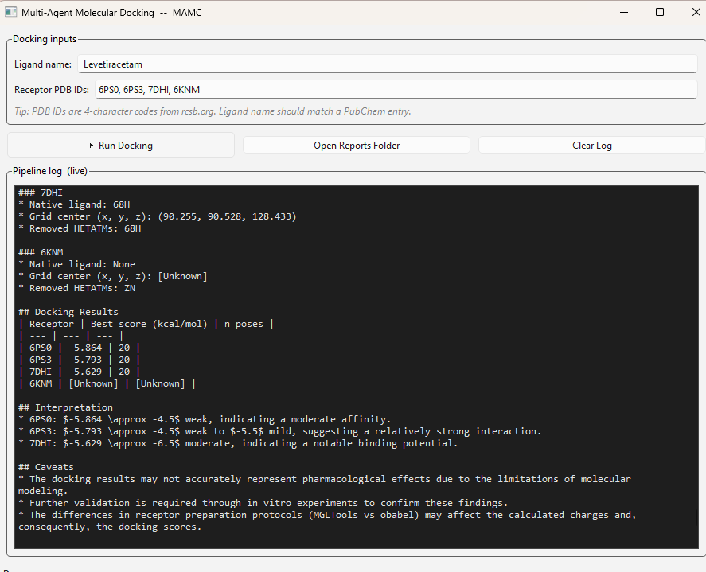

# Multi-Agent Molecular Docking GUI

**Multi-Agent AI Desktop Tool for Molecular Docking Using AutoDock Vina.**

Enter a compound name. Enter one or more receptor PDB IDs. Click **Run Docking**. Get a report.

No command-line gymnastics. No MGLTools. No cloud API keys. No patient data leaving your machine.

---

## Screenshot

<!-- Replace this placeholder with a real screenshot of your GUI after a successful run -->
<!-- Put the image in docs/screenshot.png and reference it below -->



---

## Important — read this first

This software is an **educational and exploratory tool**. Before using it, please understand:

- **Docking scores are not binding affinities.** The Vina score (kcal/mol) is a rough estimate. Correlation with experimental Ki/IC50 is typically weak (r ~ 0.3-0.5). Use scores to hypothesize, not to conclude.
- **Rigid-receptor docking misses real biology.** Induced fit, water-mediated H-bonds, allosteric states, and covalent binding are not modelled.
- **No validation step is built in.** A proper workflow re-docks the co-crystallized ligand and checks RMSD. This tool does not. Results must be interpreted with appropriate caution.
- **The LLM report can hallucinate.** Small local models occasionally produce plausible-sounding but incorrect summaries. Always verify the report against the raw `.pdbqt` and Vina log files.
- **Not for clinical, regulatory, or publication use** without independent validation and an experienced computational chemist's review.

**Appropriate uses:** MBBS/PG teaching, hypothesis generation, exploratory research before wet-lab validation.

**Inappropriate uses:** clinical decision-making, regulatory submissions, unvalidated claims in peer-reviewed drug discovery literature.

See [full limitations](#limitations) below.

---

## What it does

A desktop app that runs the complete docking workflow end-to-end:

1. **Ligand agent** - downloads your compound from PubChem, generates a 3D conformer with RDKit, converts to PDBQT using Meeko.
2. **Receptor agent** - downloads PDB entries from RCSB, removes heteroatoms/waters, prepares PDBQT receptor files.
3. **Docking agent** - runs AutoDock Vina with a default binding-site box, collects poses and scores.
4. **Visualization agent** - generates score plots and per-pose figures.
5. **Report agent** - writes a Markdown report summarizing all results.

All orchestration is done by a **local language model** (via Ollama) - no cloud API, no internet usage beyond one-shot PubChem and RCSB downloads.

---

## Quick start

### Prerequisites (one-time)

1. **Python 3.10 or newer** (tested on 3.12 and 3.13)
   Download: https://www.python.org/downloads/
   Tick "Add Python to PATH" during install.

2. **Ollama** (for the local LLM)
   Download: https://ollama.com/download
   Runs as a background service; no admin rights needed on Windows.

3. **AutoDock Vina executable** on PATH
   Download: https://github.com/ccsb-scripps/AutoDock-Vina/releases
   Rename to `vina.exe` (Windows) or `vina` (Linux/Mac), add parent folder to PATH.

4. **Open Babel** (optional, recommended)
   Download: https://openbabel.org/

### Install

```bash
git clone https://github.com/<<ManuHCI>>/multiagent-docking-gui.git
cd multiagent-docking-gui
pip install -r requirements.txt
ollama pull llama3.2:3b
```

### Run

```bash
python docking_gui.py
```

Enter `Levetiracetam` as ligand, `6CM4` as PDB ID, click Run. Output goes to `MultiAgent_Project/reports/`.

Full setup details: see [SETUP.md](SETUP.md).

---

## How it works

```
   Ligand name         PDB ID(s)
         |                  |
         v                  v
   +---------------------------+
   |     PySide6 GUI (main)    |
   +-------------+-------------+
                 |  (QThread -- keeps UI responsive)
                 v
   +---------------------------+
   |      Planner agent        |  --+
   |   (local LLM via Ollama)  |    |
   +-------------+-------------+    |
                 |                  |  LLM orchestrates which
                 v                  |  deterministic agent runs next
   +---------------------------+    |
   |   Executor / Router       | <--+
   +-------------+-------------+
                 v
   +---------------------------+
   |  Deterministic Python     |
   |  ---------------------    |
   |  Ligand    -> RDKit,Meeko |
   |  Receptor  -> PDB cleanup |
   |  Docking   -> Vina (exec) |
   |  Viz       -> matplotlib  |
   |  Report    -> LLM summary |
   +-------------+-------------+
                 v
         Markdown report + figures
```

**The science is deterministic. The LLM is just an orchestrator** - it decides what runs when, but never touches scoring functions or structural math.

---

## Configuration

### Switching the LLM

By default the tool uses `llama3.2:3b`. To use a different local model, pull it with Ollama and change one line at the top of `docking_pipeline.py`:

```python
DEFAULT_MODEL = "ollama:llama3.2:3b"      # default, 2 GB, fast
# DEFAULT_MODEL = "ollama:llama3.2:8b"    # better reports, needs ~8 GB RAM
# DEFAULT_MODEL = "ollama:qwen2.5:7b"     # good structured output
# DEFAULT_MODEL = "ollama:phi4-mini"      # best for strict JSON
```

Format is always `"ollama:<name-from-ollama-list>"`.

### Hardware recommendations

| Component | Minimum | Recommended |
|---|---|---|
| RAM | 8 GB | 16 GB+ |
| Disk | 10 GB free | 50 GB (for multiple models) |
| GPU | Not required | Optional -- Vina has GPU variants |

Typical runtime with `llama3.2:3b` on CPU: **3-10 minutes per run** (2 receptors).

---

## Limitations

The tool has real scientific and technical limitations you should understand before relying on its output.

### Scientific

- Vina scores are weakly correlated with experimental affinity
- Rigid-receptor docking ignores induced fit and conformational change
- Single crystal structure per target (no ensemble docking)
- No automatic re-dock validation of the co-crystal ligand
- Default binding-site box is the co-crystal ligand's centre of mass -- may not suit allosteric or apo targets
- 3D ligand geometry comes from PubChem/RDKit (not experimental)
- No ADMET, drug-likeness filters, or off-target screening built in

### Technical

- Small local LLMs (3B-8B) can hallucinate in reports -- verify against raw data
- No fixed random seed or replicate averaging
- No GPU acceleration of docking (CPU only)
- No cached downloads -- PDB/PubChem is re-fetched each run
- Sequential execution -- multiple receptors run one at a time
- No machine-readable run manifest (versions, seeds, parameters)

### Regulatory

- **Not a medical device. Not CDSCO-approved. Not for clinical decisions.**
- LLM-generated report text is not medical or scientific advice
- Not suitable for regulatory submissions or published drug-discovery claims without independent validation

---

## Appropriate use cases

| Use case | Suitable? |
|---|---|
| Teaching MBBS/PG students about structure-based drug design | Yes -- primary purpose |
| Exploratory research before wet-lab experiments | Yes -- with understanding of limits |
| Demonstrating docking workflow concretely in lectures | Yes |
| Hypothesis generation for research projects | Yes -- starting point |
| Published drug-discovery claims | No -- needs validated pipeline, replicates, orthogonal assays |
| Clinical treatment decisions | No -- never |
| Regulatory submissions | No -- never |
| Patient-data-linked analyses | No -- tool is not validated for this |

---

## Citation

If this tool helps your teaching or research, please cite it:

> Shetty, M.K. (2026). *Multi-Agent AI Desktop Tool for Molecular Docking Using AutoDock Vina* (Version 1.0.0) [Software]. [https://github.com/<<ManuHCI>>/multiagent-docking-gui](https://github.com/ManuHCI/multiagent-docking-gui)

GitHub's "Cite this repository" button (top right) generates BibTeX from `CITATION.cff` automatically.

**Always also cite the underlying tools:**
- AutoDock Vina: Eberhardt, J. *et al.* (2021). *J. Chem. Inf. Model.* **61**, 3891-3898.
- RDKit: Landrum, G. *et al.* https://www.rdkit.org
- Meeko: Forli Lab, Scripps Research. https://github.com/forlilab/Meeko
- Whichever language model you used (Llama, Gemma, Qwen, etc.) -- see its license page

---

## Contributing

Feedback, issues, and pull requests welcome -- especially:

- Dependency issues on fresh Windows/Linux installs
- Support for newer PDB structures or unusual ligands
- Validation/replicate features
- Improved binding-site detection
- Teaching scenarios where the tool falls short

Please open an issue before starting a large PR so we can discuss scope.

---

## Disclaimer

This software is provided **as is, without warranty of any kind**. The author (Dr. Manu Kumar Shetty) provides this freely for educational and research purposes. Users are solely responsible for:

- Interpreting results appropriately
- Understanding the scientific limitations listed above
- Complying with the license terms of all third-party dependencies, including language-model licenses
- Not using the tool for any purpose for which it is demonstrably unsuitable (clinical, regulatory, or patient-linked work)

The views expressed in this project are those of the author in a personal capacity and do not represent the official positions of Maulana Azad Medical College or Lok Nayak Hospital.

---

## License

MIT -- see [LICENSE](LICENSE).

---

## Author

**Dr. Manu Kumar Shetty**, MBBS MD
Professor, Department of Pharmacology
Maulana Azad Medical College & Lok Nayak Hospital, New Delhi, India
https://www.linkedin.com/in/manukumarshetty/

*Views expressed are personal.*
